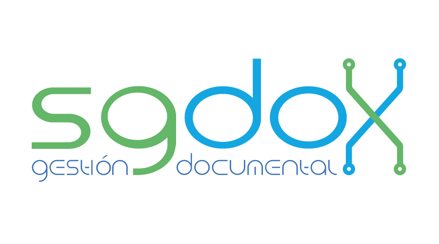

# SGDOX – Sistema de Gestión Documental

**SGDOX** es la alternativa moderna, legal y soberana frente a Quipux. Diseñado desde cero en Ecuador por **Floydu S.A.S**, está orientado a instituciones públicas, GADs, universidades y empresas que necesitan trazabilidad legal, seguridad documental y cumplimiento normativo sin depender de plataformas obsoletas o sin soporte.

A diferencia de sistemas heredados, SGDOX **no es un fork ni una adaptación**: es una plataforma **moderna, desacoplada, 100 % web y compatible con FirmaEC, LOPDP y EGSI**. 

---

## 🚀 ¿Qué puede hacer SGDOX?

SGDOX digitaliza y controla todo el ciclo de vida documental de una institución: redacción, firma, envío, seguimiento, archivo y expediente.

### ✨ Funcionalidades clave

- 🧾 **Numeración Única de Trámite (NUT)**  
  Expedientes con código único, validación por tipo, múltiples participantes y cierre formal.

- ✅ **Firma electrónica nativa y sin plugins**  
  Compatible con certificados .p12 y FirmaEC. Permite firmar desde navegador, escritorio o celular.

- 📁 **Redacción colaborativa avanzada**  
  Documentos con múltiples remitentes, control de versiones, validaciones antes de firmar y campos personalizados.

- 🔐 **Gestión avanzada de usuarios y permisos**  
  Roles jerárquicos, subrogación, listas de distribución y trazabilidad completa.

- 📬 **Bandejas inteligentes**  
  Recibidos, Enviados, En elaboración, Reasignados, Informados, Sumillados.

- 📎 **Adjuntos en cualquier formato**  
  Tamaño máximo y tipos configurables. Firma legal incluye hash SHA-256 de los adjuntos.

- 📊 **Panel estadístico gráfico**  
  Indicadores por tipo de documento, carga de usuarios, tiempos de gestión y productividad institucional.

- 🔍 **Buscador avanzado + búsqueda textual con Elasticsearch**  
  Por metadatos, contenido, estado, fechas, remitente, categoría, etc.

- 🧠 **Formulario visual de campos personalizados**  
  Definición de campos únicos por tipo documental o expediente.

- 🕵️ **Auditoría completa**  
  IP, navegador, acción, fecha, usuario, rol. Trazabilidad de cada documento y acción.

- 🔄 **Interoperabilidad vía API REST**  
  Integra con ERP, CRM, RRHH, sitios web y otras plataformas.

- 🌐 **Instalación flexible**  
  On-Premise o en la nube. 100 % Docker. Fácil actualización y despliegue.

- 📱 **SPA responsive + firma desde celular**  
  Interfaz moderna, usable en móviles y tablets sin pérdida de funcionalidad.

- 🔐 **Firma visible opcional (sello digital PDF)**  
  Visible en el documento, con respaldo legal y validación en FirmaEC.

- 🧾 **Ventanilla virtual para ciudadanos**  
  Registro manual de documentos escaneados. Integración con flujo digital interno.

- 📤 **Descarga externa con clave segura**  
  Enlace único para acceso controlado de usuarios externos.

## 💡 ¿Por qué elegir SGDOX?

- ✅ **Soberanía tecnológica**: sin dependencia de sistemas estatales.
- 🔄 **Mejor que Quipux**: arquitectura moderna, más rápido, más flexible.
- 🔐 **Legal y normativo**: FirmaEC, LOPDP, EGSI, archivo, trazabilidad.
- 💼 **Soporte real desde Ecuador**: sin tickets eternos, sin incertidumbre.
- 🛠️ **Actualizaciones activas y roadmap claro**.
- 📈 **Hecho para instituciones que quieren crecer, no adaptarse a lo viejo**.

## SGDOX no es solo un reemplazo: es la evolución natural de la gestión documental en Ecuador.

---

## 🧠 Tecnologías utilizadas

- **Frontend:** React.js (SPA)
- **Backend:** Symfony (PHP 8.1)
- **Base de Datos:** MariaDB / Oracle
- **Buscador interno:** Elasticsearch
- **PDF y firmas:** TCPDF + FirmaEC compatible
- **Seguridad:** 2FA, SHA-256, auditoría completa
- **Contenedores:** Docker con Traefik

---

## 🏛️ Casos de uso

- Municipios y GADs autónomos
- Universidades y hospitales públicos
- Empresas públicas y privadas
- Instituciones que buscan cumplir EGSI, LOPDP y deshacerse de Quipux
- Proyectos de gobierno digital con independencia documental

---

## 🔐 Licenciamiento

SGDOX se ofrece bajo dos modelos:

- **Licencia perpetua** (sin cesión de código fuente)
- **Modalidad SaaS**: pago anual con soporte, hosting y actualizaciones

---

**SGDOX** es el sistema de gestión documental que **marca el salto generacional frente a Quipux y sus derivados**, ofreciendo una nueva arquitectura enfocada en **eficiencia, seguridad y cumplimiento normativo.**  
Una plataforma **moderna, escalable y construida con tecnología desarrollada en Ecuador.**

---

**Sitio oficial:** [https://sgdox.com](https://sgdox.com)  
**Contacto:** info@floydu.com
