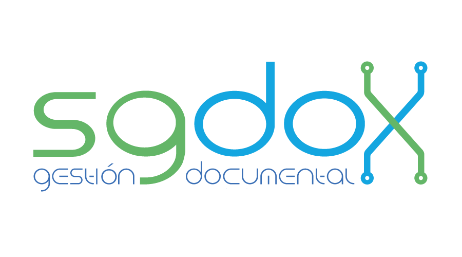

# SGDOX – Sistema de Gestión Documental para Ecuador

**SGDOX** es una plataforma integral de **gestión documental electrónica, firma electrónica y administración de expedientes**, desarrollada en Ecuador por **Floydu S.A.S.**

Está orientada a instituciones públicas y privadas que necesitan controlar formalmente sus documentos, comunicaciones institucionales, trámites, expedientes, usuarios, firma electrónica, trazabilidad y procesos administrativos.

SGDOX permite gestionar en una sola plataforma la **elaboración, revisión, firma, envío, recepción, reasignación, seguimiento, búsqueda, archivo, auditoría y organización documental**, integrando además expedientes con **Número Único de Trámite (NUT)**, ventanilla, ciudadanos y administración institucional.

SGDOX nace como una **alternativa moderna a Quipux y otros sistemas de gestión documental heredados**, diseñada para las necesidades actuales de instituciones ecuatorianas.

---

## 🚀 Gestión documental integral

SGDOX está diseñado para administrar el ciclo completo de la documentación institucional.

Permite centralizar procesos como:

- Creación y redacción de documentos.
- Revisión y validación.
- Firma electrónica.
- Envío y recepción.
- Reasignación.
- Información a otros usuarios.
- Seguimiento documental.
- Gestión de expedientes.
- Búsqueda.
- Archivo.
- Auditoría.
- Trazabilidad.

Todos estos procesos funcionan de forma integrada dentro de una misma plataforma.

---

## ✨ Funcionalidades principales

### 📄 Gestión de documentos electrónicos

SGDOX permite administrar documentos oficiales como:

- Memorandos.
- Oficios.
- Informes.
- Comunicaciones internas.
- Documentos administrativos.
- Documentos externos.
- Anexos.
- Respuestas.
- Documentos relacionados.
- Documentos vinculados a expedientes.

La plataforma incorpora herramientas para:

- Elaboración de borradores.
- Edición y revisión.
- Previsualización.
- Control de versiones.
- Gestión de destinatarios.
- Archivos adjuntos.
- Numeración institucional.
- Firma electrónica.
- Historial documental.
- Seguimiento de estados.
- Trazabilidad de acciones.

---

## 📬 Bandejas documentales

SGDOX organiza los documentos de acuerdo con su estado y participación dentro del flujo institucional.

Entre las principales bandejas se incluyen:

- **Elaboración**
- **Recibidos**
- **Enviados**
- **Reasignados**
- **Informados**
- **Archivados**
- **Eliminados**

Esto permite que cada usuario tenga una visión clara de los documentos que debe elaborar, revisar, atender, enviar, archivar o consultar.

---

## 📁 Expedientes electrónicos con NUT

SGDOX integra un módulo de **gestión de expedientes electrónicos** que permite agrupar documentos, participantes, adjuntos e información relacionada con un mismo trámite o proceso.

Entre sus capacidades se incluyen:

- Número Único de Trámite (**NUT**).
- Tipos de expediente configurables.
- Campos personalizados.
- Estados del expediente.
- Participantes.
- Roles.
- Documentos vinculados.
- Archivos adjuntos.
- Historial.
- Recorrido del expediente.
- Información archivística.
- Tareas colaborativas.
- Responsables.
- Fechas de cumplimiento.
- Alertas.
- Búsqueda especializada.
- Descarga integral del expediente.

Los expedientes permiten transformar documentos individuales en procesos administrativos organizados y trazables.

---

## 🗂️ Información archivística

SGDOX permite complementar los expedientes con información archivística institucional.

Entre los datos que pueden gestionarse se incluyen:

- Serie documental.
- Subserie documental.
- Código archivístico.
- Fechas extremas.
- Número de fojas.
- Observaciones.
- Archivo.
- Depósito.
- Estante.
- Caja.
- Carpeta.

Esto facilita la relación entre gestión documental electrónica y organización archivística.

---

## ✅ Tareas colaborativas

SGDOX integra tareas dentro de los expedientes para facilitar la coordinación entre usuarios y responsables.

Las tareas permiten gestionar:

- Responsables.
- Usuarios asignados.
- Fecha de cumplimiento.
- Estado.
- Comentarios.
- Seguimiento.
- Alertas.
- Notificaciones.
- Trazabilidad.

Esto permite asociar responsabilidades concretas a procesos documentales y expedientes.

---

## ✍️ Firma electrónica

SGDOX integra la **firma electrónica** directamente dentro del flujo documental institucional.

La plataforma permite firmar documentos electrónicos, mantener trazabilidad de las operaciones realizadas y trabajar con certificados utilizados en Ecuador.

SGDOX incorpora controles de validación y seguridad orientados a procesos de firma electrónica institucional y compatibilidad con mecanismos de verificación utilizados en el país, incluyendo **FirmaEC**.

---

## 🔐 Seguridad y autenticación

SGDOX incorpora controles orientados a proteger la información institucional y el acceso a la plataforma.

Entre sus capacidades se incluyen:

- Autenticación de usuarios.
- **Autenticación de doble factor (2FA / MFA)**.
- Protección adicional en inicio de sesión.
- Control de roles y permisos.
- Gestión de sesiones.
- Políticas de contraseña.
- Auditoría de acciones.
- Registro de trazabilidad.
- Control de acceso a documentos.
- Políticas institucionales de archivos adjuntos.
- Protección de operaciones administrativas.

---

## 🔍 Búsqueda avanzada

SGDOX incorpora búsqueda avanzada para localizar documentos y expedientes mediante diferentes criterios.

La plataforma permite realizar búsquedas por:

- Número de documento.
- Número Único de Trámite.
- Asunto.
- Contenido.
- Tipo documental.
- Remitente.
- Destinatario.
- Fechas.
- Estado.
- Área.
- Usuario.
- Expediente.
- Información asociada al trámite.

Esto facilita la recuperación de información dentro de grandes volúmenes documentales.

---

## 🏛️ Ventanilla virtual

SGDOX integra la recepción de documentación externa con los procesos internos de la institución.

La Ventanilla permite:

- Registrar documentos externos.
- Administrar ciudadanos.
- Asociar ciudadanos con trámites.
- Gestionar archivos adjuntos.
- Integrar documentación externa al flujo institucional.
- Consultar documentos registrados.
- Realizar búsquedas sobre trámites ingresados.

---

## 👤 Gestión de ciudadanos

SGDOX permite administrar ciudadanos y participantes externos de forma separada de los usuarios institucionales.

Los ciudadanos pueden vincularse con:

- Documentos.
- Trámites.
- Ventanilla.
- Comunicaciones externas.
- Expedientes.

---

## 👥 Administración institucional

SGDOX incorpora herramientas para administrar la estructura organizacional de cada institución.

Permite gestionar:

- Instituciones.
- Empresas.
- Áreas.
- Subáreas.
- Usuarios.
- Cargos.
- Roles.
- Permisos.
- Estados de usuario.
- Delegaciones.
- Subrogaciones.
- Bandejas compartidas.
- Listas de distribución.
- Tipos documentales.
- Tipos de expediente.
- Configuración institucional.
- Políticas de adjuntos.
- Configuración de seguridad.

---

## 🔄 Delegaciones y subrogaciones

SGDOX permite mantener la continuidad operativa durante:

- Vacaciones.
- Ausencias.
- Encargos.
- Subrogaciones.
- Cambios temporales de responsabilidad.

Los usuarios autorizados pueden actuar dentro de los flujos correspondientes manteniendo la trazabilidad de las acciones realizadas.

---

## 👥 Listas de distribución

SGDOX permite crear grupos institucionales reutilizables para facilitar el envío de documentos a múltiples destinatarios.

Las listas de distribución permiten:

- Agrupar usuarios.
- Mantener grupos frecuentes.
- Reducir selección manual.
- Facilitar comunicaciones institucionales.
- Mejorar la gestión de destinatarios.

---

## 📎 Gestión de archivos adjuntos

SGDOX permite gestionar archivos adjuntos asociados a documentos y expedientes.

La plataforma incorpora controles para:

- Tipos de archivo permitidos.
- Tamaños máximos.
- Validación de archivos.
- Gestión de adjuntos documentales.
- Gestión de adjuntos de expedientes.
- Políticas institucionales.

---

## 🕵️ Auditoría y trazabilidad

SGDOX mantiene registro de las acciones realizadas sobre documentos, expedientes y usuarios.

La trazabilidad permite identificar:

- Usuario.
- Fecha.
- Hora.
- Acción.
- Documento.
- Expediente.
- Estado.
- Envío.
- Recepción.
- Reasignación.
- Firma.
- Archivo.
- Cambios relevantes.

Esto permite reconstruir el recorrido de la documentación y mantener evidencia de las operaciones realizadas dentro de la plataforma.

---

## 📊 Dashboard institucional

SGDOX incorpora un Dashboard para visualizar información relacionada con la actividad documental.

Permite consultar:

- Indicadores de bandejas.
- Actividad reciente.
- Volumen documental.
- Estados.
- Información operativa.
- Carga de trabajo.

---

## 🌐 Plataforma web y responsive

SGDOX es una plataforma web diseñada para operar desde navegadores modernos.

Puede utilizarse desde:

- Computadoras.
- Laptops.
- Tablets.
- Teléfonos celulares.

Esto permite acceder a los procesos documentales sin depender de aplicaciones de escritorio tradicionales para la operación cotidiana.

---

---

# 🇪🇨 SGDOX como alternativa a Quipux

**Quipux** ha sido durante años una de las principales referencias de gestión documental dentro del sector público ecuatoriano.

SGDOX fue desarrollado como una **alternativa moderna a Quipux y otros sistemas documentales heredados**, orientada a instituciones que necesitan mayor flexibilidad, evolución, seguridad, administración y capacidad de integración.

SGDOX no es una modificación, fork ni adaptación de Quipux.

Es una plataforma independiente desarrollada en Ecuador por **Floydu S.A.S.**

SGDOX integra:

- Gestión documental institucional.
- Firma electrónica.
- Expedientes electrónicos.
- Número Único de Trámite.
- Bandejas documentales.
- Ventanilla virtual.
- Gestión de ciudadanos.
- Auditoría.
- Trazabilidad.
- Búsqueda avanzada.
- Administración institucional.
- Seguridad.
- Integraciones.
- Plataforma web moderna.

SGDOX está orientado a instituciones que buscan modernizar o reemplazar plataformas documentales heredadas manteniendo el control formal de sus procesos administrativos.

---

# 🇪🇨 Sistema de gestión documental desarrollado en Ecuador

SGDOX está diseñado considerando las necesidades de gestión documental de instituciones ecuatorianas.

Puede utilizarse en:

- Gobiernos Autónomos Descentralizados (**GAD**).
- Municipios.
- Prefecturas.
- Empresas públicas.
- Universidades.
- Instituciones educativas.
- Hospitales.
- Entidades de salud.
- Entidades de control.
- Ministerios.
- Instituciones del Gobierno Central.
- Empresas privadas.
- Organizaciones con procesos administrativos formales.

---

# 💡 Beneficios de SGDOX

- Gestión integral de documentos electrónicos.
- Plataforma 100 % web.
- Firma electrónica integrada.
- Expedientes electrónicos con NUT.
- Gestión formal de envío y recepción.
- Trazabilidad documental.
- Auditoría de acciones.
- Gestión de ciudadanos.
- Ventanilla virtual.
- Delegaciones y subrogaciones.
- Listas de distribución.
- Gestión de usuarios, áreas y permisos.
- Políticas institucionales.
- Búsqueda avanzada.
- Dashboard institucional.
- Autenticación de doble factor.
- Gestión de sesiones.
- Plataforma responsive.
- Integración con otros sistemas.
- Despliegue en nube o infraestructura institucional.
- Soporte especializado desde Ecuador.
- Evolución continua del producto.

---

# 🧠 Plataforma tecnológica

SGDOX utiliza una arquitectura web moderna, preparada para operar en entornos institucionales y soportar la evolución continua de la plataforma.

Sus principales componentes incluyen:

- Interfaz web.
- Servicios de aplicación.
- Base de datos relacional.
- Motor especializado de búsqueda documental.
- Servicios de integración.
- Infraestructura basada en contenedores.

Esta arquitectura permite desplegar SGDOX tanto en entornos administrados como en infraestructura propia de cada institución.

---

# 🔌 API e integraciones

SGDOX está preparado para integrarse con otros sistemas institucionales.

Las integraciones pueden incluir:

- Sistemas administrativos.
- Plataformas institucionales.
- Servicios de identidad.
- Servicios de correo.
- Proveedores de firma electrónica.
- Portales ciudadanos.
- Aplicaciones externas.
- Servicios complementarios.

---

# 🐳 Modalidades de implementación

## SGDOX SaaS

SGDOX puede utilizarse como servicio administrado.

Dependiendo del contrato puede incluir:

- Hosting.
- Actualizaciones.
- Mantenimiento.
- Respaldos.
- Monitoreo.
- Soporte técnico.

---

## Infraestructura institucional

SGDOX puede desplegarse en infraestructura administrada directamente por la institución.

Esto incluye:

- Servidores físicos.
- Servidores virtuales.
- Centros de datos institucionales.
- Nube privada.
- Infraestructura virtualizada.

---

## Nube pública

SGDOX también puede implementarse sobre infraestructura cloud de acuerdo con los requerimientos de disponibilidad, seguridad y contratación de cada institución.

---

# 🕓 Historia y evolución de SGDOX

SGDOX se encuentra en desarrollo continuo desde **2018**.

## 2018 — SGDOX Alpha

Las primeras versiones establecieron los fundamentos de la plataforma de gestión documental.

Desde esta etapa se desarrollaron conceptos como:

- Documentos.
- Elaboración.
- Envío.
- Recepción.
- Reasignación.
- Informados.
- Historial.
- Ciudadanos.
- Plantillas.
- Adjuntos.
- Organización institucional.

---

## 2023 — SGDOX v1.0

En 2023 se consolidó la primera generación oficial de SGDOX.

La plataforma reunió años de evolución funcional y permitió operar procesos completos de gestión documental institucional.

---

## 2025 — SGDOX v2.0

En 2025 SGDOX dio paso a una **segunda generación completamente renovada**.

La plataforma fue reescrita preservando el conocimiento funcional acumulado durante años, pero modernizando su base tecnológica y preparando el producto para una nueva etapa de crecimiento.

---

## 2026 — SGDOX 2.x

La segunda generación amplía SGDOX como plataforma integral de:

- Gestión documental.
- Firma electrónica.
- Expedientes.
- NUT.
- Información archivística.
- Tareas.
- Dashboard.
- Búsqueda.
- Seguridad.
- Administración institucional.
- Auditoría.
- Trazabilidad.

---

# 📈 Más de ocho años de evolución

SGDOX tiene más de ocho años de evolución en gestión documental institucional.

Durante este tiempo ha atravesado:

- una etapa Alpha;
- una primera generación productiva;
- una renovación tecnológica completa;
- múltiples versiones;
- cientos de mejoras funcionales;
- evolución basada en necesidades reales de operación documental.

Esta trayectoria ha permitido acumular conocimiento sobre procesos de:

- Elaboración.
- Firma.
- Envío.
- Recepción.
- Reasignación.
- Archivo.
- Ciudadanos.
- Expedientes.
- Usuarios.
- Auditoría.
- Seguridad.
- Trazabilidad.

SGDOX combina esa experiencia funcional con una plataforma preparada para continuar evolucionando.

---

# 🎯 Gestión documental para transformación digital

La gestión documental es uno de los componentes centrales de la transformación digital institucional.

SGDOX permite centralizar procesos documentales que tradicionalmente se encuentran dispersos entre papel, correo electrónico, archivos compartidos y diferentes sistemas.

Con SGDOX una institución puede:

- Reducir procesos manuales.
- Disminuir el uso de papel.
- Mejorar el seguimiento de trámites.
- Fortalecer la trazabilidad.
- Facilitar la búsqueda de documentos.
- Centralizar la información.
- Mejorar la continuidad operativa.
- Mantener evidencia de las acciones realizadas.
- Integrar documentación interna y externa.
- Organizar expedientes y procesos administrativos.

---

# 📜 Licenciamiento y propiedad intelectual

SGDOX es una plataforma propietaria desarrollada por **Floydu S.A.S.**

Su implementación, uso, soporte, mantenimiento, capacitación y actualización se realizan de acuerdo con las condiciones comerciales y contractuales establecidas para cada institución.

La contratación o autorización de uso de SGDOX no implica cesión del código fuente ni transferencia de derechos de propiedad intelectual, salvo acuerdo contractual expreso.

El código fuente y los componentes propietarios de SGDOX se mantienen en repositorios privados protegidos.

El uso, copia, modificación, distribución, despliegue o comercialización no autorizados requieren autorización expresa de **Floydu S.A.S.**

---

# 🌐 SGDOX Ecuador

**Sitio oficial:** [https://sgdox.com](https://sgdox.com)

**Correo:** [info@floydu.com](mailto:info@floydu.com)

---

# 🇪🇨 SGDOX – Gestión documental de nueva generación para Ecuador

**SGDOX es una plataforma integral de gestión documental electrónica, firma electrónica y expedientes desarrollada en Ecuador.**

Documentos, firma, bandejas, expedientes, búsqueda, ventanilla, ciudadanos, usuarios, seguridad, administración y trazabilidad forman parte de una **única plataforma integrada**.

Con desarrollo continuo desde 2018 y una nueva generación tecnológica consolidada, SGDOX ofrece a las instituciones una alternativa moderna para transformar y controlar su gestión documental.

**Gestión documental. Firma electrónica. Expedientes. NUT. Ventanilla. Trazabilidad. Seguridad. Ecuador.**
